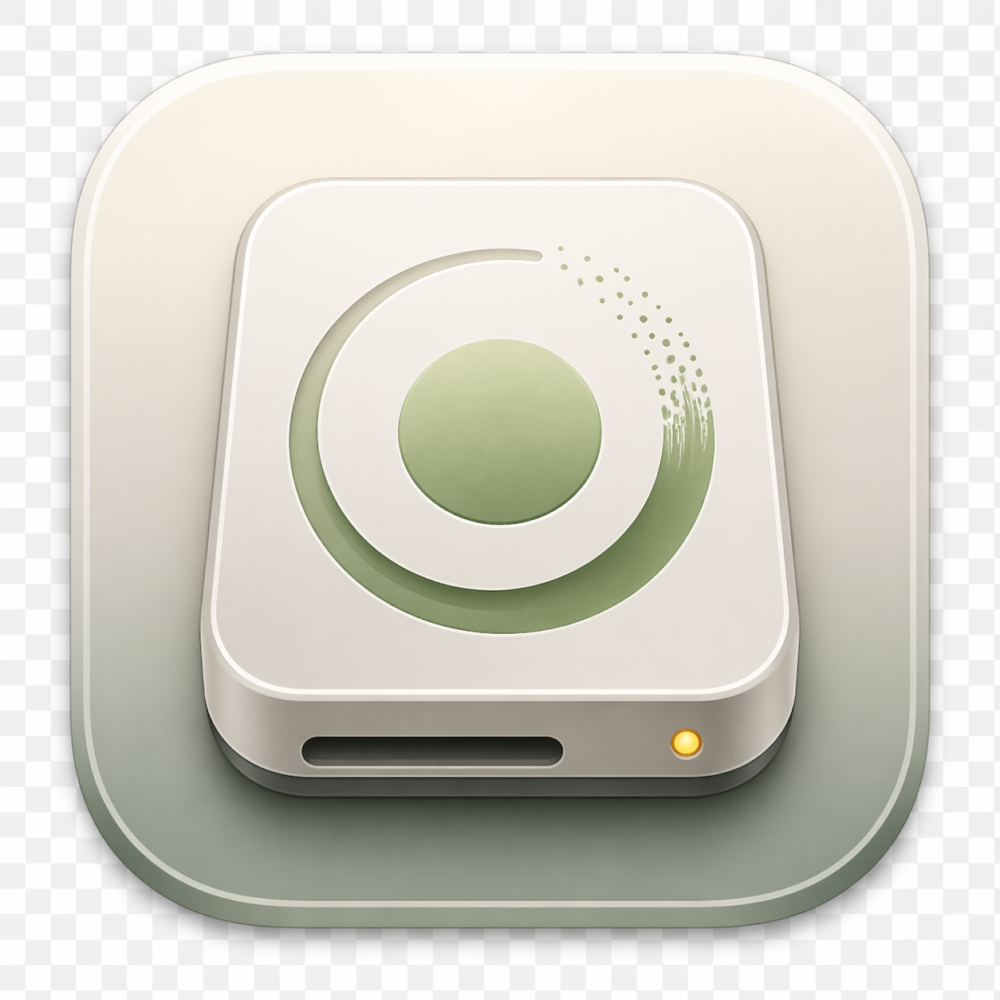
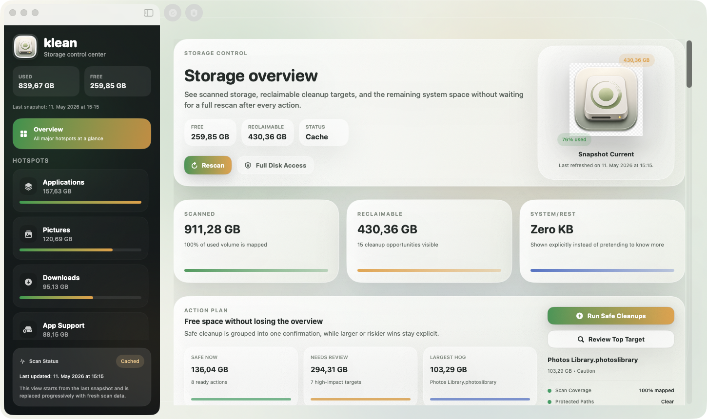

# klean

<p align="center">
  
</p>

<p align="center">
  Native macOS storage dashboard and cleanup utility for reclaiming space with confidence.
</p>

<p align="center">
  Built with SwiftUI for developer machines, storage hotspots, and safe cleanup routines.
</p>



## What It Does

`klean` gives you a readable overview of what is using storage on your Mac and lets you act on the parts that are reasonably safe to manage.

- Volume overview with analyzed storage, free space, and a transparent `System/Rest` bucket for the parts macOS does not attribute precisely.
- Hotspot scanning for common storage offenders such as `Documents`, `Downloads`, `Desktop`, `Applications`, `Pictures`, `Movies`, `Music`, `iCloud Drive`, `Caches`, `Xcode DerivedData`, `Xcode Archives`, simulators, and trash.
- Safe cleanup actions for known areas like user caches, Xcode build data, archives, and trash.
- Dedicated developer cleanup routines for caches and build artifacts from workflows like Xcode, SwiftPM, Flutter, CoreSimulator, and Docker build cache.
- Finder integration to reveal files or move items to trash directly from the app.
- Live feedback after cleanup actions with optimistic UI updates and an immediate rescan.
- Faster startup through cached snapshots and incremental scan updates while fresh results stream in.

## Why It Exists

macOS exposes some storage categories well and hides others behind vague system totals. `klean` aims to make that tradeoff explicit instead of pretending to know more than the system really provides.

The app shows:

- what can be scanned and explained
- what can be cleaned safely
- what remains opaque and therefore stays visible as `System/Rest`

## Startup And Scan Behavior

To avoid a blank dashboard every time the app opens, `klean` stores the last successful snapshot in Application Support and restores it immediately on launch. If that snapshot is stale, a fresh scan starts automatically. During scanning, refreshed sections replace the cached data progressively, so you can already see what has been loaded instead of waiting for one big final result.

## Tech Stack

- Swift 6
- SwiftUI
- AppKit integration where macOS-specific behavior is needed
- XcodeGen for project generation
- Native macOS target, deployment target `macOS 15`

## Build

### Requirements

- Xcode 16 or newer
- [XcodeGen](https://github.com/yonaskolb/XcodeGen)

### Generate And Run

```bash
xcodegen generate
open klean.xcodeproj
```

Or build from the command line:

```bash
xcodebuild -project klean.xcodeproj -scheme klean -configuration Debug CODE_SIGNING_ALLOWED=NO build
```

## Privacy And Permissions

- All scanning happens locally on your Mac.
- No storage data is uploaded anywhere by the app.
- For deeper visibility into protected folders, the app or Xcode may need Full Disk Access.
- Some system-managed storage remains inherently opaque on macOS. `klean` keeps that explicit instead of guessing.

## Project Structure

```text
klean/
  Models/
  Services/
  ViewModels/
  Views/
project.yml
```

## Current Scope

This repository is focused on a polished first native desktop version:

- strong visual overview
- practical cleanup workflows
- developer-first routine cleanup dashboard
- live state updates
- cached startup instead of repeated cold scans

## Notes

The current app copy is mostly German. The codebase and repository documentation are kept in English so the project is easier to share publicly.
